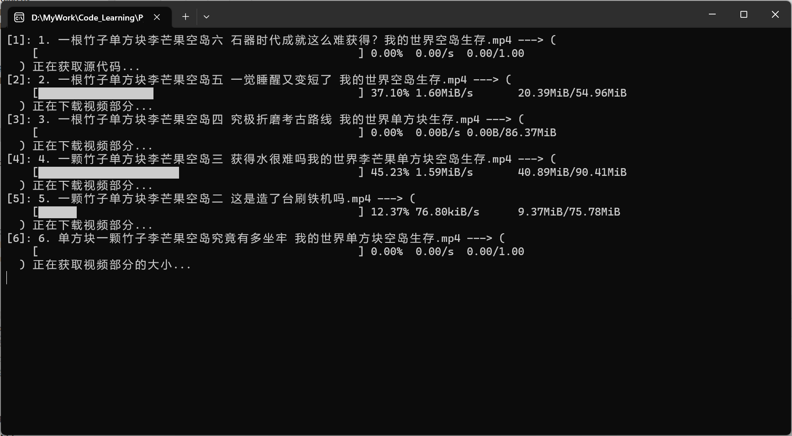

# Bilibili_Downloader
A simple bilibili video downloader / 一个简单的哔哩哔哩视频下载器

# Discription / 描述
1. 采用Python协程开发，目前设立了12个客户端并行下载
2. 单个视频下载速度极佳，多个视频则会受到服务端限制（在get方法处阻塞），但总体速度依然很快
3. 音视频合并部分目前采用ffmpeg，因为工具太大了无法上传，如果使用还需按工具目录中的说明确保工具备齐
4. 可在登录状态下载视频，需要手动填写SESSDATA（Cookie中复制过来就行）
5. 可以断点续传，也就是说上次下载的内容如果被打断，下次下载时还可以恢复进度（实现起来不简单，详情请查看DownItem.arrange_fragments()方法）

# Declaration / 声明
This repository is merely for studying, and please don't use it for illegal intention! If there's any transgression, all of the ill effects and consequences are not related to me

此仓库仅用于学习，切勿用于违法目的！如违反，任何不良影响及后果与本人无关

# Todo list / 接着做的事情
- [ ] 加入代理功能
- [ ] 寻找更精简且不慢的音视频合并工具（遗憾的是，目前可能只有ffmpeg适合）
- [x] 使能下载1080P视频，并能够选择清晰度（已实现）
- [ ] 加入多选GUI，使能自选视频于多视频
- [ ] 在实现更高级GUI界面后，添加设置功能
- [ ] 支持旧的AV号链接

# Prospection / 展望
- [ ] 可采用其他语言进一步开发GUI界面
- [ ] 可支持更多网站的视频下载
